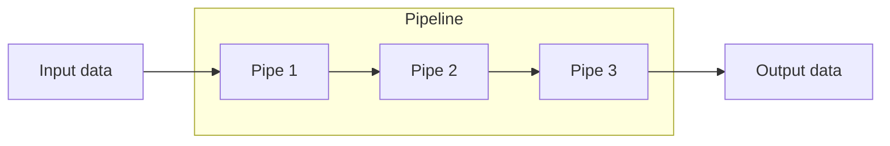
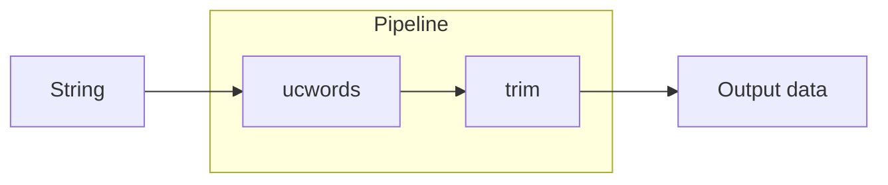
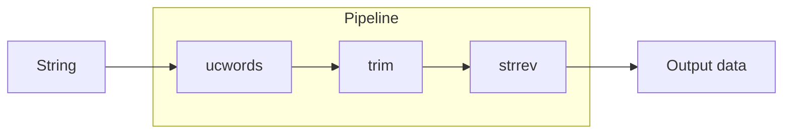
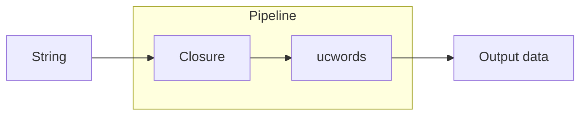
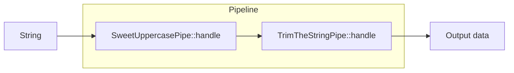
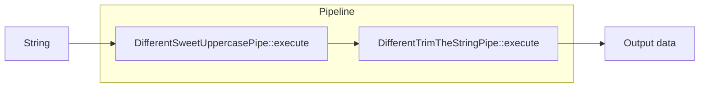
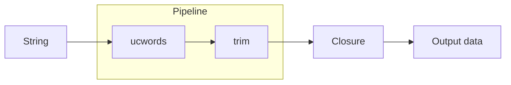

# StellarWP Pipeline

[](https://github.com/stellarwp/pipeline/actions?query=branch%3Amain) [](https://github.com/stellarwp/pipeline/actions/workflows/static-analysis.yml)

A Pipeline / [Chain of Responsibility](https://refactoring.guru/design-patterns/chain-of-responsibility) design pattern implementation based on [Laravel's Pipeline implementation](https://github.com/illuminate/pipeline/blob/master/Pipeline.php).

A `Pipeline` is an object that accepts input data and _sends_ it through a series of handlers (or "pipes") — which are functions, closures, and/or classes — to get a result at the end.



## Table of contents

* [Installation](#installation)
* [Prerequisites](#prerequisites)
* [Getting started](#getting-started)
  * [Creating a simple pipeline](#creating-a-simple-pipeline)
  * [Building pipelines in parts](#building-pipelines-in-parts)
  * [Using functions](#using-functions)
  * [Using closures](#using-closures)
  * [Using classes with the `handle` method](#using-classes-with-the-handle-method)
  * [Using classes with a custom method](#using-classes-with-a-custom-method)
  * [Doing more than returning](#doing-more-than-returning)
  * [Using a container in the pipeline](#using-a-container-in-the-pipeline)
* [Methods](#methods)
  * [`pipe()`](#pipe) (aliases: `add_pipe()`)
  * [`send()`](#send)
  * [`set_container()`](#set_container) (aliases: `setContainer()`)
  * [`then()`](#then) (aliases: `run()`)
  * [`then_return()`](#then_return) (aliases: `run_and_return()`, `thenReturn()`)
  * [`through()`](#through) (aliases: `pipes()`)
  * [`via()`](#via)

## Installation

It's recommended that you install Pipeline as a project dependency via [Composer](https://getcomposer.org/):

```bash
composer require stellarwp/pipeline
```

> We _actually_ recommend that this library gets included in your project using [Strauss](https://github.com/BrianHenryIE/strauss).
>
> Luckily, adding Strauss to your `composer.json` is only slightly more complicated than adding a typical dependency, so checkout our [strauss docs](https://github.com/stellarwp/global-docs/blob/main/docs/strauss-setup.md).

**An important note on namespaces:**

> The docs will in this repo all use `StellarWP\Pipeline` as the base namespace, however, if you are using [Strauss](#strauss)
> to prefix namespaces in your project, you will need to adapt the namespaces accordingly. (Example: `Boom\Shakalaka\StellarWP\Pipeline`)

## Prerequisites

There aren't any required prerequisites of note.

However! If you wish to use the [container-based pipes](#using-a-container-in-the-pipeline), you will need a container that conforms to the `ContainerInterface` interface found in [stellarwp/container-contract](https://github.com/stellarwp/container-contract).

## Getting started

Luckily, there isn't a whole lot to Pipelines from a code perspective, so implementing them is pretty easy. We'll walk
through some of the basic concepts.

***Important note:** The examples provide a string as input data. That is just for simplicity's sake! You can
actually pass whatever you want - a scalar, an object, an array, whatever.*

### Creating a simple pipeline

Let's say you have a string that you want to pass through a series of steps in order to manipulate it. You can create a
pipeline to do that like so:



```php
use StellarWP\Pipeline\Pipeline;

// Create a new pipeline instance.
$pipeline = new Pipeline();

// Send a string through the pipeline.
$result = $pipeline->send( 'a sample string that is passed through to all pipes.' )
	->through(
		'ucwords',
		'trim'
	)->then_return();

// The output would be stored in $result and would be:
// A Sample String That Is Passed Through To All Pipes.
echo $result;
```

### Building pipelines in parts

You don't need to build the pipeline all at once, you can spread it out over a number of lines.



```php
use StellarWP\Pipeline\Pipeline;

// Create a new pipeline instance.
$pipeline = new Pipeline();

// Declare the pipes that you want to run against the
// string in the order you want them to execute.
// The method `pipes()` is an alias of `through()`.
$pipeline->pipes(
	'ucwords',
	'trim'
);

// Add another pipe to the pipeline.
// The method `add_pipe()` is an alias of `pipe()`.
$pipeline->add_pipe( 'strrev' );

// Declare what you are sending through the pipeline.
$pipeline->send( 'potato    ' );

// Process the pipeline and get the result.
// The method `run()` is an alias of `then_return()`.
$result = $pipeline->run();

// The result will be: `otatoP`
echo $result;
```

### Using closures

If you have a more complicated function that you wish to use as a pipe, you can pass in a callable instead of a string.
Your closure will need to accept two parameters, the first being the input data and the second being the next item in the pipeline.




```php
use StellarWP\Pipeline\Pipeline;

$pipeline  = new Pipeline();

$pipeline->pipes(
	static function ( $passable, Closure $next ) {
		$passable = str_ireplace( 'All', 'All The', $passable );

		return $next( $passable );
	},
	'ucwords'
);

$pipeline->send( 'a sample string that is passed through to all pipes.         ' );
$result = $pipeline->run();

// The output would be stored in $result and would be:
// A Sample String That Is Passed Through To All The Pipes.
echo $result;
```

### Using classes with the `handle` method

You can even create your own classes to use as pipes in the pipeline. For a class to be usable in the pipeline, it needs
a method that accepts two parameters, the first being the input data and the second being the next item in the pipeline.

By default, the Pipeline expects that the method is called `handle`. If you want to use that method name, you can
optionally implement the `StellarWP\Pipeline\Contracts\Pipe` interface to enforce that method convention.

#### Example classes

First class:
```php
use StellarWP\Pipeline\Contracts\Pipe;

class SweetUppercasePipe implements Pipe {
	public function handle( $passable, Closure $next ) {
		$passable = ucwords( $passable );

		return $next( $passable );
	}
}
```

Second class:
```php
use StellarWP\Pipeline\Contracts\Pipe;

class TrimTheStringPipe implements Pipe {
	public function handle( $passable, Closure $next ) {
		$passable = trim( $passable );

		return $next( $passable );
	}
}
```

#### Example pipeline



```php
use StellarWP\Pipeline\Pipeline;

$pipeline = new Pipeline();

$pipeline->pipes(
	new SweetUppercasePipe(),
	new TrimTheStringPipe()
);

$pipeline->send( 'a sample string that is passed through to all pipes.         ' );
$result = $pipeline->run();

// The output would be stored in $result and would be:
// A Sample String That Is Passed Through To All Pipes.
echo $result;
```

### Using classes with a custom method

If you want to use classes but want to use a different method than the expected default (`handle`), you can declare
the alternate method name using the `via()` method.

#### Example classes

First class:
```php
class DifferentSweetUppercasePipe {
	public function execute( $passable, Closure $next ) {
		$passable = ucwords( $passable );

		return $next( $passable );
	}
}
```

Second class:
```php
class DifferentTrimTheStringPipe {
	public function execute( $passable, Closure $next ) {
		$passable = trime( $passable );

		return $next( $passable );
	}
}
```

#### Example pipeline



```php
use StellarWP\Pipeline\Pipeline;

$pipeline = new Pipeline();

// Set the method to use the `execute()` method instead of the default `handle()`.
$pipeline->via( 'execute' );

$pipeline->pipes(
	new DifferentSweetUppercasePipe(),
	new DifferentTrimTheStringPipe()
);

$pipeline->send( 'a sample string that is passed through to all pipes.         ' );
$result = $pipeline->run();

// The output would be stored in $result and would be:
// A Sample String That Is Passed Through To All Pipes.
echo $result;
```

### Doing more than returning

Sometimes you may want to do more than returning the result when the pipeline completes. You can do that by
using the `then()` (or its alias, `run()`) method instead of `then_return()`.

#### Example pipeline



```php
use StellarWP\Pipeline\Pipeline;

// Create a new pipeline instance.
$pipeline = new Pipeline();

// Declare the pipes that you want to run against the
// string in the order you want them to execute.
// The method `pipes()` is an alias of `through()`.
$pipeline->pipes(
	'ucwords',
	'trim'
);

// Declare what you are sending through the pipeline.
$pipeline->send( 'a sample string that is passed through to all pipes.         ' );

// Process the pipeline and get the result.
$result = $pipeline->then( static function ( $passable ) {
	return str_ireplace( 'A Sample', 'A Nice Long', $passable );
} );

// The output would be stored in $result and would be:
// A Nice Long String That Is Passed Through To All Pipes.
echo $result;
```

### Using a container in the pipeline

Pipelines can be instantiated with a container that conforms to the [stellarwp/container-contract](https://github.com/stellarwp/container-contract) `StellarWP\ContainerContract\ContainerInterface` interface.
Adding a container to the pipeline allows you to pass classes as pipes and allow those classes to be instantiated when
the pipeline is being run.


```php
use StellarWP\Pipeline\Pipeline;
use MyProject\Container;

// Create a new container instance.
$container = new Container();
$pipeline  = new Pipeline( $container );

// Let's add some classes to the pipeline that we declared in a previous example.
$pipeline->pipes(
	SweetUppercasePipe::class,
	TrimTheStringPipe::class
);

$pipeline->send( 'a sample string that is passed through to all pipes.         ' );
$result = $pipeline->run();

// The output would be stored in $result and would be:
// A Sample String That Is Passed Through To All Pipes.
echo $result;
```

## Methods

### `pipe()`

This method is used to add a pipe to the pipeline.

```php
public function pipe( array|mixed $pipes ): self
```
*Aliases: `add_pipe()`*

#### Examples
```php
$pipeline->pipe( 'ucwords' );
// or
$pipeline->add_pipe( 'ucwords' );
// or
$pipeline->pipe( [ 'ucwords', 'trim' ] );
```

### `send()`

This method is used to set the object being passed through the pipeline.

```php
public function send( mixed $passable ): self
```

#### Examples
```php
// Send a scalar.
$pipeline->send( 'Some string' );

// Send an object.
$pipeline->send( $my_object );
```

### `set_container()`

This method is used to set the container instance.

```php
public function set_container( ContainerInterface $container ): self
```

**Aliases:** `setContainer()`

#### Examples
```php
$pipeline->set_container( $container );
```

### `then()`

This method is used to run the pipeline and return the result.

```php
public function then( Closure $destination = null ): mixed
```

**Aliases:** `run()`

#### Examples
```php
$pipeline->then();

// Use the alias.
$pipeline->run();

// Provide a function to run before returning the result.
$pipeline->then( 'trim' );

// Provide a closure to run before returning the result.
$pipeline->then( static function ( $passable ) {
	return trim( $passable );
} );

// Provide an object as a pipe to run before returning the result.
$pipeline->then( new TrimTheStringPipe() );

// Provide an class name as a pipe to run before returning the result.
$pipeline->then( TrimTheStringPipe::class );
```

### `then_return()`

This method is used to run the pipeline and return the result.

```php
public function then_return(): mixed
```

Aliases: `run_and_return()`, `thenReturn()`

#### Examples
```php
$pipeline->then_return();
// Use an alias.
$pipeline->thenReturn();
// Use the other alias.
$pipeline->run_and_return();
```

### `through()`

This method is used to set the handlers (or "pipes") that are used to process the data.

```php
public function through( array|mixed $pipes ): self
```

Aliases: `pipes()`

#### Examples
```php
// You can provide any number of pipes.
$pipeline->through( 'ucwords', 'trim' );

// Using the alias.
$pipeline->pipes( 'ucwords', 'trim' );

// Pass an array of pipes.
$pipeline->through( [ 'ucwords', 'trim' ] );

// Pass closures as pipes.
$pipeline->through( static function ( $passable, Closure $next ) {
	$passable = str_ireplace( 'All', 'All The', $passable );

	return $next( $passable );
} );

// Pass objects as pipes.
$pipeline->through( new SweetUppercasePipe(), new TrimTheStringPipe() );

// If you have a container, you can pass class names as pipes.
$pipeline->through( SweetUppercasePipe::class, TrimTheStringPipe::class );
```

### `via()`

This method is used to set the method to call on the pipes.

```php
public function via( string $method ): self
```

#### Examples
```php
// Set the method used in a class to process the data as `execute()`.
$pipeline->via( 'execute' );

// Set the method used in a class to process the data as `borkborkbork()`.
$pipeline->via( 'borkborkbork' );
```
